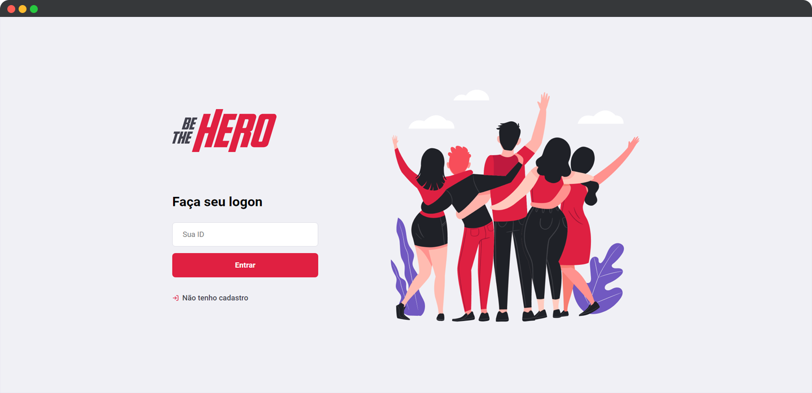

<h1 align="center">
  
</h1>

<p align="center">
  

  
</p>

<br>

<p align="center">
  
</p>

<br>

## 🧪 Tecnologias

Esse projeto foi desenvolvido com as seguintes tecnologias:

- [React](https://reactjs.org)
- [Node.js](https://nodejs.org/en/)
- [Knex](https://knexjs.org/)
- [React Native](https://facebook.github.io/react-native/)
- [Expo](https://expo.io/)
- [TypeScript](https://www.typescriptlang.org/)

## 💻 Projeto

O Be The Hero é um projeto que visa conectar ONG's (Organizações não governamentais) e outras instituições que necessitam de algum tipo de ajuda a pessoas que podem contribuir.

O Be The Hero foi desenvolvido com o objetivo de proporcionar um espaço para que qualquer pessoa possa ajudar monetariamente uma ONG, podendo de certa forma salvar o dia.

Este é um projeto desenvolvido durante a **[Next Level Week Together](https://nextlevelweek.com/)**, apresentada nos dias 23 a 27 de Março de 2020.

## 🔖 Layout

Você pode visualizar o layout do projeto através do link abaixo:

- [Layout Web e Mobile](https://www.figma.com/file/2C2yvw7jsCOGmaNUDftX9n/Be-The-Hero---OmniStack-11/duplicate)

É necessário ter uma conta no [Figma](http://figma.com/) para acessá-lo.

## 🚀 Como executar

Clone o projeto e acesse a pasta do mesmo.

```bash
$ git clone https://github.com/rafaelramosdev/semana-omnistack-11
$ cd semana-omnistack-11
```

A aplicação é dividida em três partes: web, mobile e backend, a versão web e o aplicativo mobile precisam que o backend esteja sendo executado para funcionar. Para iniciar a aplicação, siga os passos abaixo:

## Rodando a versão backend

```bash
# Entra na pasta da versão backend
$ cd backend

# Instala as dependências
$ npm install

# Cria as migrates (tabelas do banco de dados)
$ npm run knex:migrate

# Inicia o server
$ npm run dev

# O servidor estará ouvindo a porta 3333 e estará disponível no endereço http://localhost:3333
```

## Rodando a versão web

```bash
# Entra na pasta da versão web
$ cd web

# Instala as dependências
$ npm install

# Inicia a versão web
$ npm run start
```

O website estará disponível no seu navegador pelo endereço [`http://localhost:3000`](http://localhost:3000).

## Rodando a versão mobile

```bash
# Entra na pasta da versão mobile
$ cd mobile

# Instala as dependências
$ npm install

# Inicia o aplicativo
$ expo start
```

Com seu smartphone, escaneie o QRCode que aparecerá no terminal ou na página que abrir utilizando o aplicativo Expo.

É necessário ter o aplicativo Expo Go instalado no seu celular.

- [Play Store](https://play.google.com/store/apps/details?id=host.exp.exponent)
- [App Store](https://apps.apple.com/br/app/expo-go/id982107779)

## 📄 Licença

Esse projeto está sob a licença MIT. Veja o arquivo [LICENSE](LICENSE) para mais detalhes.

---

Fique ligado nas próximas edições do [Next Level Week](https://nextlevelweek.com/), é um evento gratuito que você não pode deixar passar, recomendo muito!

Feito by [Rafael Ramos](https://rafaelramos.dev/) 🙋🏻‍♂️
